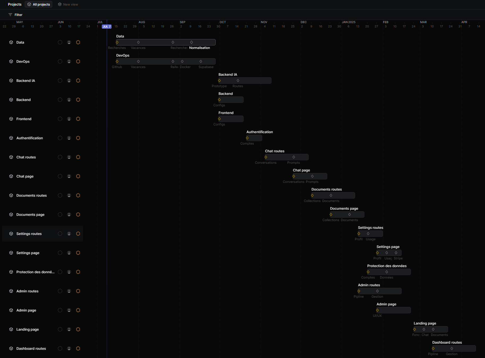
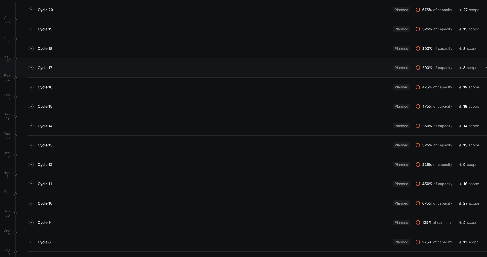

# Fonctionnalités (comment ?)

### **Fonctionnelles**

| **fonctionnalité** | **description** |
| --- | --- |
| **Création de compte** | L’utilisateur a la possibilité de créer un compte pour accéder à l’application. Il peut utiliser son mail ou un service tiers. |
| Profils customisable | L’utilisateur peut modifier ses informations ainsi que son statut (particulier, auto-entrepreneur) |
| **Import de documents** | L’utilisateur peut importer ses documents, pour générer des rapports ou poser des questions dessus. |
| **Choix du niveau de connaissance** | L’utilisateur choisi le niveau de connaissance affilier au compte, cela permet d’avoir plus ou moins d’explications dans les réponses. |
| **Questions prédéfinies** | L’utilisateur aura accès à de questions prédéfinie dans le chat par rapport aux choix de son profils |
| **Questions sur documents** | L’utilisateur peut poser des questions sur des documents fournis par nos soins (finances, comptabilité…) |
| **Historique et gestion de conversations** | Mise en place d’un historique des conversations |
| **Scan de documents** | L’utilisateur a la possibilité d’importer et traiter des documents textuels tel que pdf, txt, md… |
| **Dashboard et rapports personnalisés** | L’utilisateurs aura accès à un dashboard composé de rapports (synthèses, conseils et informations clés) sur les documents importés. |
| **Exports de rapports** | Possibilité d’exporter des rapports du dashboard |
| **Forum** | L’utilisateur aura accès à un forum communautaire, il pourra poster des questions a ses pairs, les aministrateurs peuvent modérer le forum et poster des annonces générales. |
| Conformité | L’application web se doit d’être conforme aux réglementations (RGPD…) sur le stockage et la gestion des données utilisateurs. |

### **Techniques**

- **Data**
    
    Projet regroupant les taches pour les datas et les connaissances générales pour l'IA.
    
    | **tâche** | **description** |
    | --- | --- |
    | Données lois/droit | Recherche des lois françaises et du droit actuelles sur la finance et la comptabilité. |
    | Données réglementations | Recherche des réglementations françaises en vigueurs sur la finance et la comptabilité. |
    | Données cours | Recherche cours universitaires publiques sur la finance et la comptabilité. |
    | Normalisation data | Découpage et normalisation des documents au format markdown via des scripts python.
    
    Les documents supportés doivent être au format pdf, txt, md et html. |
- **DevOps**
    
    Projet regroupant les taches concernant le devops comme :
    
    - les accès, les connexions
    - les images docker
    - les environnements et services railway
    
    | **tâche** | **description** |
    | --- | --- |
    | Création des repositories github | Création des repositories frontend, backend et ia.
    Création des branches dev dans les repositories. |
    | Création des services railway | Création des services railway pour le frontend, le backend et le backend ia.
    
    Configuration des services et des variables d'environnement.
    
    Le backend est utilisé par le frontend, sont endpoint est publique.
    Le frontend est utilisé par tous les utilisateurs, sont endpoint est publique. |
    | Configuration des environnements railway | Préparation des environnement railway 'dev' et 'prod'. |
    | Création de la database supabase users | Pour le stockage des utilisateurs il est nécessaire de créer et configurer une databases supabase.
    La gestion se fera via le front en utilisant clerk. |
    | Création de la vector database supabase | Pour le stockage et l'accessibilité des embeddings (documents globaux et utilisateurs) il est nécessaire de créer et configurer des vector databases supabase. |
    | Dockerfile Frontend | L'image doit être basé sur bun et compiler l'application nextjs. |
    | Dockerfile Backend | L'image doit être basé sur bun et compiler l'application hono.. |
    | Dockerfile IA | L'image doit être basé sur python et installer les packages. |
    | Accès Database | La database supabase est utilisée par le frontend et le backend, sont endpoint est publique.
    
    Dans le backend il est possible de faire une migration du schema vers la database.
    
    Dans le backend, connection à la database et configuration du schema.
    Les schemas sont fait dans les pages respectives. |
- **Backend IA**
    
    Projet regroupant les taches pour le backend IA et ses pipelines.
    
    | **tâche** | **description** |
    | --- | --- |
    | Prototype | Le protype doit permettre :
    - d'ingérer et de traiter des documents
    - de les stocker dans une collection supabase
    - de query une collection spécifique
    
    Lors du développement et pour faciliter les tests du backend et du frontend, des collections générales seront mises en place via le prototype. |
    | Message sans context | Le backend envoie un message et le système prompt à utilisé, puis reçoit une réponse de l'ia.
    
    La pipeline n'utilise pas de connaissances et de collections. |
    | Ingestion document | Il est doit être possible d'ingérer un document dans une collection. Le nom est spécifié.
    La collection est créée si elle n'existe pas.
    
    Le backend s'occupe de l'assignation et de la vérification des collections aux utilisateurs.
    Ajout de meta data à chaque document pour faciliter sa gestion. |
    | Historique messages | Implémentation de l'historique de la conversation dans le prompt de l'ia.
    
    Utiliser la conversation ainsi que le message de l'utilisateur  dans le prompt, bien spécifié à l'ia comment les utiliser et réflechir à sa réponse. |
    | Message avec context | Le backend envoie un message, le système prompt et la collection à utilisés, puis reçoit une réponse de l'ia.
    
    La pipeline utilise une collection pour répondre au message de l'utilisateur. |
    | Suppression collection | Il est possible de supprimer une collection (vector database supabase) via son nom.
    
    Les utilisateurs peuvent supprimer leurs collections mais pas les globales. |
    | Suppression document | Il est possible de supprimer un document précit d'une collection vector database en utilisantet filtrant avec  les meta data.
    
    Les utilisateurs peuvent supprimer les documents de leurs collections.
    Les administrateurs peuvent modifier les documents des collections globales. |
    | Génération de rapports | Il est possible de généré un rapport sur un document selon un message donné tel que 'résume moi ce document', 'quelles sont les données clées de ce document ?'… |
- **Backend**
    
    Projet regroupant les taches générales pour le backend.
    
    Les taches concernant les pages et les implementations sont dans leurs projets respectifs.
    
    | **tâche** | **description** |
    | --- | --- |
    | Api-Key | Le backend est accéder via un header api-key |
    | BiomeJS | Implémentation du formatter biome dans le backend. |
    | Swagger | Implémentation de la documentation Swagger dans l'application hono.
    
    Utilisation du format OpenAPI pour décrire les routes et leur fonctionnement. |
- **Frontend**
    
    Projet regroupant les taches générales pour le frontend.
    
    Les taches concernant les pages et les implementations sont dans leurs projets respectifs.
    
    | **tâche** | **description** |
    | --- | --- |
    | BiomeJS | Implémentation du formatter biome dans le backend. |
    | Tests unitaires | Définir la méthode des tests de l'interface et des components pour vérifier la conformité de l'application. |

- **Authentification**
    
    Projet regroupant les taches pour l'authentification et la gestion des utilisateurs.
    
    | **tâche** | **description** |
    | --- | --- |
    | Compte Administrateur | L'applicatiion bénéficie de compte administrateurs via clerk.
    Dans le backend, les admins peut utiliser l'ia sans limites, les crédits restant ne sont ni vérifiés, ni utilisés.
    
    Dans le frontend, les admins ont accès à un pannel permattant de modifier certains aspects de l'application. |
    | Compte OAuth | L'utilisateur peut se connecter via divers providers, dont google et github.
    
    Lors que la création du compte, certaines informations seront récupérées automatiquement via le provider (username, email…). |
    | Compte Email | L'utilisateur peut se connecter via son email et son mot de passe.
    
    Lors que la création du compte, il devra renseigner son email, son username et password (firstname et lastname sont optionnels). |
- **Chat page**
    
    ***Routes***
    
    Projet regroupant toutes les taches concernant les implémentations (routes) de la page chat.
    
    Sur cette page, il est possible de gérer ses conversation, d'envoyer et recevoir des messages. Il est aussi possible d'utiliser des questions prédéfinis et de poser des question sur un groupe de documents.
    
    | **tâche** | **description** |
    | --- | --- |
    | Schéma database conversations | Schéma de la table conversations ainsi que sa liaison aux users.
    
    Dans une conversation, il y a un un nom, un id, un user id, une liste de messages (objects json). |
    | Création, récupération et suppression conversations | Il est possible de récupérer une conversation pour l'afficher dans le frontend.
    
    Il est aussi possible de créer et supprimer une conversation. |
    | Envoie de messages | Le backend recoie un message et l'id d'une conversation. il traite le message et l'ajoute à la conversation dans la database, puis return le réponse de l'ia.
    
    Le système prompt adapté au niveau de connaissances doit être implémenter et transmis au backend ia. |
    
    ***UI/UX***
    
    Projet regroupant toutes les taches concernant la page chat.
    
    Sur cette page, il est possible de gérer ses conversation, d'envoyer et recevoir des messages. Il est aussi possible d'utiliser des questions prédéfinis et de poser des question sur un groupe de documents.
    
    | **tâche** | **description** |
    | --- | --- |
    | Liste des conversations | L’utilisateur pourra accéder à l’historique de ses conversations, et les supprimer s’il le souhaite via le backend. |
    | Envoie de messages | En bas du chat, l'utilisateur peut envoyer des message via un input.
    Il est aussi possible de choisir parmis les listes de questions prédéfinies.
    
    Le message est affiché avec l'annotation user.
    Si erreur, possibilité de renvoyer le message. |
    | Réception de messages | Dans le chat, après l'envoie d'un message, l'utilisateur recoit une réponse de l'ia et l'affiche avec l'annotation assistant. |
    | Choix connaissances | Sur la gauche de l'input, l'utilisateur peut accéder à un menu et choisir la collection des connaissances utilisées pour questionner l'ia.
    
    Les collections sont gérées dans la page documents.
    Lors du développement et pour faciliter les tests, des collections générales seront mises en place via le prototype d'ingestion et de traitements |
- **Documents page**
    
    ***Routes***
    
    Projet regroupant toutes les taches concernant les implémentations (routes) de la page documents.
    
    Sur cette page, il est possible de d'ajouter et gérer les collections et les documents.
    
    | **tâche** | **description** |
    | --- | --- |
    | Schéma collections | Chaque collection possède un nom, un user id et une liste de nom de documents. Le nom de la collection doit être unique sur la plateforme.
    
    Une différenciation est nécessaire entre les collections utilisateurs et globales, une collection globale n'a pas besoins d'un user id et peut utiliser null. |
    | Gestion collection | Il est possible de créer et supprimer ces collections via leur id. Il est possible de modifier la liste des noms de documents d'une collection. Il est aussi possible de récupérer les informations d'une collection.
    
    Une suppression entrainera la suppression des vector database supabase associés.
    
    Une vérification de la collection et de son proprioétaire est nécéssaire avant de récupérer ses informations, de la modifier ou de la supprimer.
    
    Un administrateur peut gérer des collection globales.
    
    Un utilisateur à la possibilité d'obtenir une liste de ses collections et des collections globales. |
    | Ingestion de documents | L'utilisateur a la possibilité d'ajouter un document à une collection en précisant son id.
    
    Il faut vérifier que la collection appartient bien à l'utilisateur, ou si la collection n'a pas de user id, si l'administrateur fait la requête.
    
    Le fichier est envoyé au backend ia, il s'occupera du traitement du fichier, de sa conversation en embeddings et du stockage dans la collection avec le nom du documents en meta data. |
    | Suppression de documents | L'utilisateur a la possibilité de supprimer un document à une collection en précisant le nom du document et le nom de la colleciton. |
    
    ***UI/UX***
    
    Projet regroupant toutes les taches concernant la page documents.
    
    Sur cette page, il est possible de d'ajouter et gérer les collections et les documents.
    
    | **tâche** | **description** |
    | --- | --- |
    | Collections | Il est possible de voir la liste des collection, d'en ajouter et supprimer (cards). |
    | Documents | Il est possible de voir la liste des documents d'une collection, d'en ajouter ou d'en supprimer (cards). |
- **Settings page**
    
    ***Routes***
    
    Projet regroupant toutes les taches concernant les implémentations (routes) dela page settings.
    
    Sur cette page, il est possible de modifier les information du profile, de voir l'usage de l'ia, les crédits restant et d'ajouter des crédits via un paiement stripe.
    
    | **tâche** | **description** |
    | --- | --- |
    | Modification profile | L'utilisateur à la possibilité de modifier ses informations :
    - prénom, nom
    - pseudo, email, avatar
    - statut professionnel |
    | Modification niveau de connaissance | L'utilisateur à la possibilité de modifier son niveau de connaissance.
    
    Pour facilité l'accès, une route permet de récupérer tous les apperçus de réponses d'ia. |
    | Gestion usage | Pour fournir des statistiques sur l'usage de l'ia à l'utilisateur, il faut log le nombre de conversations, le total de charactères utilisés. |
    | Gestion crédits | Il faut définir le prix moyen de 1 000 charactères (paramétrable dans le pannel admin).
    
    Pour fournir des statistiques sur l'usage de l'ia à l'utilisateur, il faut aussi log les crédits restant et les réduire en fonction de l'usage.
    
    Il est possible de récupérer la valeur des crédits restant.
    Un paiement stripe permettra d'ajouter des crédits, une route peut être nécessaire. |
    
    ***UI/UX***
    
    Projet regroupant toutes les taches concernant la page settings.
    
    Sur cette page, il est possible de modifier les information du profile, de voir l'usage de l'ia, les crédits restant et d'ajouter des crédits via un paiement stripe.
    
    | **tâche** | **description** |
    | --- | --- |
    | Informations | Visualisation et customisation des informations de l'utilisateur |
    | Niveau de connaissance | Un slider permet de choisir le niveau de connaissances attendu dans les réponses de l’IA.
    
    Un apperçu d'une réponse de l'ia sera affiché et évoluera avec le slider.
    Les apperçus de réponses sont envoyé en groupe, et non au changement de niveau. |
    | Usage et statistiques | Il est nécessaire d'afficher l'utilisation actuelle de l'ia à l'utilisateur.
    
    Afficher le prix moyen de 1 000 charactères, le nombre de conversations en cours, le total de charactères utilisé et les crédits restant. |
    | Ajout crédits | Paiement stripe pour l'ajout de crédits.
    Les crédits sont représenter en $. |
- **Protection des données**
    
    Projet regroupant les taches pour la protection des données des utilisateurs.
    
    | **tâche** | **description** |
    | --- | --- |
    | Données comptes | Sécurisation des identifiants de connection des users via clerk. |
    | Données bancaires | Sécurisation des cartes bancaires des utilisateurs via stripe. |
    | Documents utilisateurs | Sécurisation de l'accès aux documents de chaque utilisateur.
    
    Protection du backend ia par un secret connu seulement par le backend principal et un endpoint privé. |
    | Filtres données sensibles | Filtrage de certaines informations sensibles des documents utilisateurs, anonymisation des données récupérées lors de la pipeline de l'ia (prompt) |
- **Admin page**
    
    ***Routes***
    
    Projet regroupant toutes les taches concernant les implémentations (routes) de la page admin.
    
    Cette page permet aux administrateurs de modifier certains aspects de la plateforme.
    
    | **tâche** | **description** |
    | --- | --- |
    | Gestion questions prédéfinies | Tous les utilisateurs peuvent récupérer les listes de questions prédéfinies.
    
    Les administrateurs peuvent modifier ces listes.
    Il faut que le nombre de liste reste adapté au nombre de niveaux de connaissances maximal. |
    | Pipeline et stockage | L'importation, le traitement et le stockage sont définies dans la page documents. |
    | Gestion prix | Les administrateurs ont la possibilité de modifier le nombre de crédits que coutent 1 000 charactères. |
    
    ***UI/UX***
    
    Projet regroupant toutes les taches concernant la page admin.
    
    Cette page permet aux administrateurs de modifier certains aspects de la plateforme.
    
    | **tâche** | **description** |
    | --- | --- |
    | Questions prédéfinies | Les administrateurs ont la possibilité de visualiser et modifier les listes de questions prédéfinies. |
    | Connaissances | Les administrateurs ont la possibilité d'ajouter, modifier ou supprimer des collections de connaissanes (documents) de la plateforme et de l'ia.
    
    Utilisation des componenets de la page documents des utilisateurs. |
    | Utilisateurs | Des administrateurs ont accès à une page clerk pour gérer les utilisateurs de la plateforme. |
    | Prix | Des administrateurs ont la possibilité de modifier le nombre de crédits que coutent 1 000 charactères. |
- **Landing page**
    
    Projet regroupant toutes les taches concernant la page landing.
    
    Cette page donne un aperçu de l'application et de ses fonctionnalités.
    
    | **tâche** | **description** |
    | --- | --- |
    | Présentation des fonctionnalités | Cartes présentants les différentes fonctionnalitées majeures de l'application dont le chat avec l'ia, les documents utilisateurs, la sécurité, le forum. |
    | Apperçu chat | Un apperçu du chat avec l'ia montrant une question sur des connaissances et une réponse. |
    | Apperçu documents | Un apperçu de la gesiton des documents utilisateur. |
- **Dashboard page**
    
    ***Routes***
    
    Projet regroupant toutes les taches concernant les implémentations (routes) de la page dashboard.
    
    Sur cette page, il est possible de visualiser, générer et gérer des rapports de l'ia sur des documents utilisateurs.
    
    | **tâche** | **description** |
    | --- | --- |
    | Schéma rapports | Chaque rapport possède un titre, un user id et un contenu. Le contenu est au format markdown. |
    | Gestion de rapports | L'utilisateur a la possibilité de créer, récupérer et supprimer des rapports.
    
    La génération de rapport ce fait au niveau de la pipeline ia. |
    | Pipeline de rapports | Pipeline de génération de rapports avec l'ia.
    
    La pipeline recoit un document ainsi qu'une query tel que 'résume le document' ou 'extrait les informations clées…'. Ce rapport sera stocker dans le database et accéssible par l'utilisateur, il sera aussi return par la pipeline via le backend. |
    | Téléchargement de rapports | L'utilisateur peut télécharger un rapport au format pdf. |
    
    ***UI/UIX***
    
    Projet regroupant toutes les taches concernant la page dashboard.
    
    Sur cette page, il est possible de visualiser, générer et gérer des rapports de l'ia sur des documents utilisateurs.
    
    | **tâche** | **description** |
    | --- | --- |
    | Génération de rapports | L'utilisateur va envoyer un document ainsi qu'une query tel que 'résume le documents' ou 'extraits les information clés…'. Le rapport résultant sera return par le backend pour l'afficher directement dans le frontend. |
    | Visualisation de rapports | Cards présentatant les différents rapports générés. Possibilité de supprimer un rapport.
    
    Les rapports sont au format markdown. |
    | Export de rapports | Bouton permettant d'exporter et télécharger un rapport. |
- **Forum page**
    
    ***Routes***
    
    Projet regroupant toutes les taches concernant les implémentations (routes) de la page forum.
    
    Cette page contient des catégories, piblications et réponses.
    
    | **tâche** | **description** |
    | --- | --- |
    | Schéma annonces | Une annonce contient un id et message. |
    | Gestion annonces | Tous les utilisateurs peuvent récupérer la liste des annonces (toutes les lignes de la table).
    
    Les administrateurs peuvent ajouter ou supprimer une annonce de la liste. |
    | Schéma database catégories | Une catégorie possède un nom, une description et un id. |
    | Création et suppression catégorie | Les administrateurs peuvent créer et supprimer des catégories en précisant un nom et une description. |
    | Modification catégorie | Les administrateurs peuvent modifier le nom et la description d'une catégorie en précisant son id. |
    | Schéma database publication | Une publication possède un titre, un message, un id et l'id de l'auteur. |
    | Création publication | Les utilisateurs peuvent créer une publication en précisant un nom et un contenu. |
    | Modification publication | Les utilisateurs peuvent modifier le nom et le contenu leur publication en précisant son id.
    
    Les administrateurs peuvent modifier le nom et le contenu d'une publication en précisant son id. |
    | Suppression publication | Les utilisateurs peuvent supprimer leur publication en précisant leur id.
    
    Les administrateurs peuvent supprimer une publication en précisant son id.
    Toutes les réponses de cette publication doivent être supprimmées. |
    | Schéma database réponses | Une réponse possède un message, un id et l'id de l'auteur. |
    | Création réponse | Les utilisateurs peuvent ajouter une réponse en précisant un message. |
    | Modification réponse | Les utilisateurs peuvent modifier le message de leur réponse en précisant son id.
    
    Les administrateurs peuvent modifier le message d'une réponse en précisant son id. |
    | Suppression réponse | Les utilisateurs peuvent supprimer leur réponse en précisant leur id.
    
    Les administrateurs peuvent supprimer une réponse en précisant son id. |
    
    ***UI/UX***
    
    Projet regroupant toutes les taches concernant la page forum.
    
    Cette page contient des catégories, piblications et réponses.
    
    | **tâche** | **description** |
    | --- | --- |
    | Annonces | Une petite banière en haut du forum permet aux administrateurs de notifier les utilisateurs des nouveautés et changements de la plateforme.
    
    Il peut y avoir plusieurs annonces d'afficher en même temps.
    Le numéro de l'annonce est spécifié à côté de l'annonce.
    
    Les administrateurs peuvent modifier ou supprimer une annonce. |
    | Forum Catégories | Une liste verticale de toutes les catégories.
    
    Chaque catégorie est composé de la sorte :
    - le nom
    - en dessous du nom, la description
    - tout à droite, le nombres de publications
    
    Les administrateurs peuvent créer, modifier ou supprimer une catégorie. |
    | Forum Publications | Une liste verticale de toutes les publications.
    
    Chaque publication est composé de la sorte :
    - le titre
    - en dessous du tire, l'auteur
    - tout à droite, le nombres de réponses
    
    La page de la publication est composée de la sorte :
    - l'auteur en haut à gauche
    - à côté de l'auteur, le titre
    - en dessous de l'auteur et du tire, le contenu
    - en dessous du contenu, les réponses
    
    Les utilisateurs peuvent créer, modifier ou supprimer une de leur publication.
    Les administrateurs peuvent modifier ou supprimer une publication. |
    | Forum Réponses | Une liste verticale des réponses.
    
    Chaque réponse est composé de la sorte :
    - le nom
    - en dessous du nom, le message
    
    L'utilisateur peut créer, modifier ou supprimer une réponse.
    L'administrateur peut modifier ou supprimer n'importe quelle réponse. |
    | Forum Modération | Affichage d'une annotation 'admin' à côté du nom des administrateurs. |
    | Forum Markdown | Support du markdown dans l'affichage des publications et réponses. |

### Roadmap

Nos fonctionnalités et tâches sont regroupées dans des projets. Ces projets sont ensuite placés sur une timeline.

Les projets sont séparés par des milestones à des dates précises. Les tâches y sont réparties.

La roadmap est accéssible sur [notre Linear](https://linear.app/esp-cc/projects/all).

Les tâches sont réparties dans des cycles correspondants à nos sprints.

### Assignation

Les tâches ont été préassignées en fonction des compétences de chacun et de la difficulté de ces dernières. lors d’une réunion ESP d’une heure avec le chef de groupe, nous avons review et valider les assignations. Certaines tâches n’ont pas été assignées et vont être atribuées aux personnes recrutées. Nous feront de nouvelles reviews au fur et à mesure des mercatos.

L’estamisation de la difficulté d’une tâche se faire au cours d’un vote avec l’ensemble du groupe. Ensuite, lors d’une discussion nous difiniton le niveau de difficulté final.