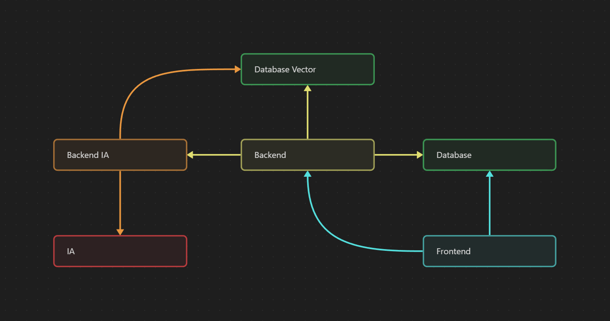

# Infrastructure DevOps

---

schéma de l’infra générale

### **Frontend**

Le frontend doit pouvoir accéder à la databse et au backend principal.

1 service Railway via un repository et un dockerfile.

Le dockerfile est basé sur celui de [bun](https://hub.docker.com/r/oven/bun).

Il va installer les dépendances bun, build et start l’application.

### **Database**

La database doit être accéssible seulement par le frontend et le backend.

La vector database doit être accéssible par le backend et le backend ia.

1 projet Supabase contenant une database et une vector database.

### **Backend**

Le backend doit pouvoir accéder au backend ia, à la database et à la vector database.

1 service Railway via un repository et un dockerfile.

Le dockerfile est basé sur celui de [bun](https://hub.docker.com/r/oven/bun).

Il va installer les dépendances bun, build et start l’application.

### **Backend IA**

Le backend ia doit pouvoir accéder à la vector database et à l’ia. Le backend ia doit être accéssible seulement par le backend.

1 service Railway via un repository et un dockerfile basé sur celui de [python](https://hub.docker.com/_/python) sur debian.

Il va installer les dépendances python et start l’application.

### **IA**

L’ia doit être accéssible par le backend ia.

Un accès à l’api de [Groq](https://console.groq.com/playground).