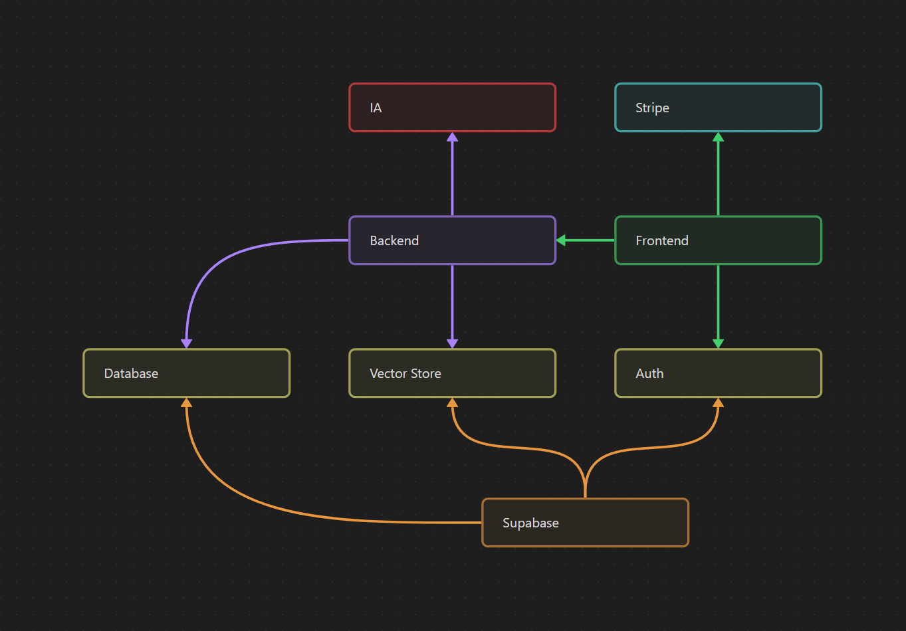

# Infrastructure DevOps

---

schéma de l’infra générale

> Nous avons 2 instances de l'infrastructure, prod et dev.

### **Frontend**

Le frontend communique avec la partie authentification de Supabase ainsi que le backend.

Nous avons 2 machines Fly.io, 1 prod et 1 dev. Le frontend a son propre repository et son dockerfile.

Le dockerfile est basé sur celui de [bun](https://hub.docker.com/r/oven/bun).

Il va installer les dépendances bun, build et start l’application.

### **Backend**

Le backend s'occupe de la modification et l'intéractions avec la database et les tables. Il s'occupe aussi de la partie vector store.

Nous avons 2 machines Fly.io, 1 prod et 1 dev. Le frontend a son propre repository et son dockerfile.

Le dockerfile est basé sur celui de [bun](https://hub.docker.com/r/oven/bun).

Il va installer les dépendances bun, build et start l’application.

### **Supabase**

Certains composants de Supabase sont utilisés par le frontend et le backend.

Le frontend se connecte en tant que user, avec ses permisisons et policies RLS.
Le backend est connecté en tant qu'admin à la database.

### **IA**

Le backend utilise l'api de [Groq](https://groq.com) pour intéragir avec les modèles.